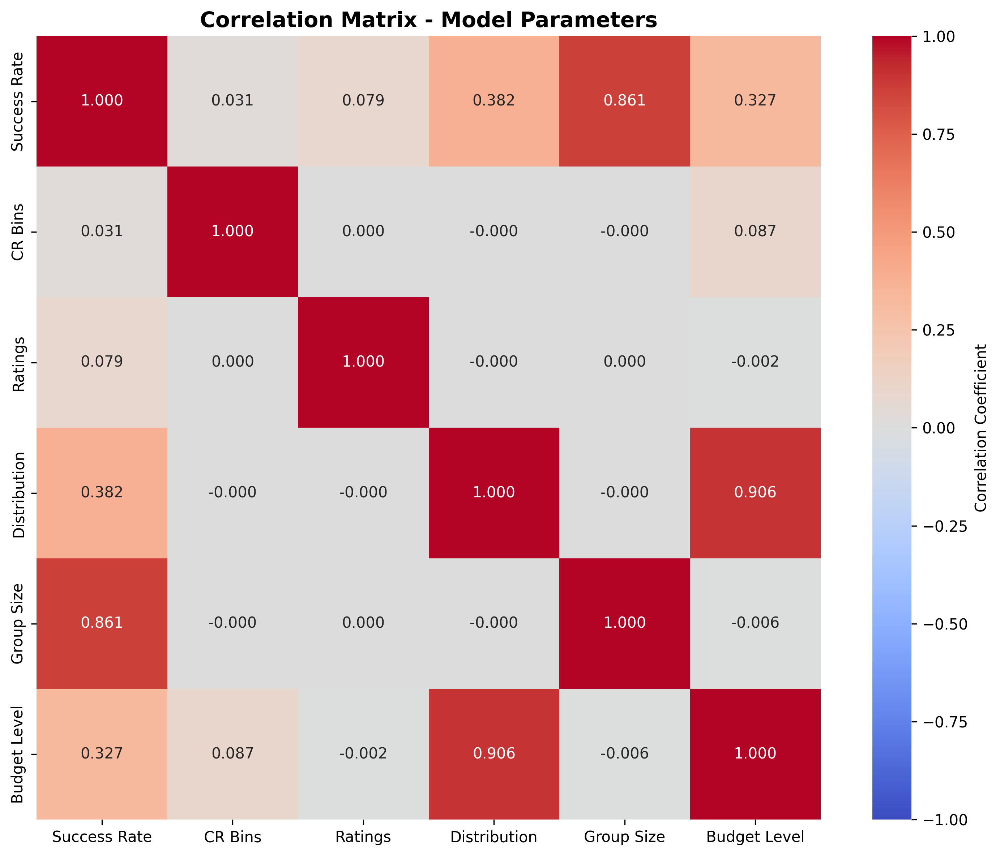

# Бюджетирование повышений зарплат: Валидация метода, Анализ ограничений и Оптимизаци (Merit Matrix Budgeting: Validation, Analysis, and Optimization)

## Автор
Алексей Иванов  
Итоговый проект программы «Специалист по Data Science», НИУ ВШЭ

---

## Содержание
1. [Краткое резюме](#краткое-резюме)
2. [Описание проблемы](#описание-проблемы)
3. [Структура проекта](#структура-проекта)
4. [Часть 1: Monte Carlo Validation](#часть-1-monte-carlo-validation)
5. [Часть 2: Анализ результатов](#часть-2-анализ-результатов)
6. [Часть 3: Генетический алгоритм - решение проблемы](#часть-3-генетический-алгоритм---решение-проблемы)
7. [Общие выводы](#общие-выводы)

---

## Краткое резюме

### TL;DR

**Исследуемый вопрос:** Насколько надежен широко используемый метод агрегированных распределений для расчета бюджета повышений зарплат?

**Метод:** Monte Carlo симуляция на данных 395,325 сотрудников из Москвы, тестирование 120 конфигураций merit matrices.

**Главный вывод:** Метод имеет фундаментальное ограничение применимости — требует 200+ сотрудников для приемлемой точности (80%+ success rate), что делает его **непригодным для 75-80% компаний** из-за необходимости функциональной сегментации.

**Решение:** Разработан генетический алгоритм, который преодолевает выявленные ограничения и работает для групп от 50 человек с success rate 82-94%.

---

## Описание проблемы

### Что такое Merit Matrix?

**Merit Matrix (матрица повышений)** — инструмент HR для определения процента повышения зарплаты на основе двух параметров:

1. **Compa Ratio (CR)** — отношение текущей зарплаты к рыночной медиане или серединной точки в структуре вознаграждения (midpoint) для сотрудника:
   - CR < 1.0: ниже рынка
   - CR = 1.0: на рынке
   - CR > 1.0: выше рынка

2. **Performance Rating** — оценка эффективности сотрудника, определяемая непосредственным руковожителем (обычно от 3 до 7)

**Пример Merit Matrix 5×5:**

| CR / Rating | R1 | R2 | R3 | R4 | R5 |
|-------------|----|----|----|----|----| 
| < 0.80 | 6% | 10% | 14% | 17% | 20% |
| 0.80-0.90 | 5% | 9% | 12% | 15% | 18% |
| 0.90-1.10 | 3% | 7% | 10% | 13% | 16% |
| 1.10-1.20 | 2% | 5% | 8% | 11% | 13% |
| > 1.20 | 1% | 3% | 6% | 8% | 10% |

### Фундаментальная проблема прогнозирования бюджета

**Проблема временного разрыва:**
- **Q3-Q4:** HR утверждает бюджет на повышения
- **Q1:** Менеджеры присваивают рейтинги сотрудникам
- **Разрыв:** 3-6 месяцев между планированием и реализацией

**Что HR знает:**
- Выделенный бюджет на повышение заработных плат для группы сотрудников
- Merit Matrix (проценты повышений), которая разрабатывается самим HR
- Распределение сотрудников по диапазоном CR
- Целевое распределение рейтингов (10%-20%-40%-20%-10%), которое задается политикой или историческими данными

**Что HR не знает и не контролирует:**
- Какому конкретно сотруднику (с каким CR) какой рейтинг будет присвоен
- Будут ли менеджеры строго придерживаться заданного распределения

### Метод агрегированных распределений

HR использует формулу:

```
Ожидаемый бюджет = Σ P(CR_bin_i) × P(Rating_j) × Merit(i,j)
```

где:
- `P(CR_bin_i)` — доля сотрудников в CR-бине (известно из данных)
- `P(Rating_j)` — целевая доля рейтинга j (задается политикой)
- `Merit(i,j)` — процент из матрицы

**Почему "агрегированных распределений"?**
- Метод **агрегирует** (объединяет) два независимых распределения:
  1. Распределение сотрудников по CR bins (известно из данных)
  2. Целевое распределение рейтингов (задается HR политикой)

- Бюджет рассчитывается как математическое ожидание по этим распределениям

**Вопрос исследования:** Насколько точен этот метод в реальности? Как часто реальный бюджет попадает в заданный диапазон (например, ±5% от расчета по агрегированным распределениям)?
---

## Структура проекта
```
merit_matrix_project/
├── data/
│   └── Moscow.parquet.gzip                    # Подготовленные данные (конфиденциальны)
├── notebooks/
│   ├── 01_Monte_Carlo_Simulation.ipynb        # Часть 1: Симуляции
│   ├── 02_Results_Analysis.ipynb              # Часть 2: Анализ
│   └── 03_Genetic_Algorithm_Optimizer.ipynb   # Часть 3: Оптимизация
├── visualizations/
│   └── threshold_analysis.png                 # Графики
└── README.md                                  # Данный документ
```


## Часть 1: Monte Carlo Validation

### Цель

Проверить точность метода агрегированных распределений через симуляцию реальных сценариев присвоения рейтингов.

### Методология

**Для каждой группы сотрудников (Company × Function):**

1. **Рассчитать baseline:** бюджет по методу агрегированных распределений
2. **Провести 50,000 симуляций:**
   - Случайно присвоить рейтинги согласно целевому распределению
   - Добавить реалистичные вариации (Dirichlet distribution)
   - Рассчитать реальный бюджет по merit matrix
   - Проверить попадание в диапазон ±5%
3. **Рассчитать success rate:** % симуляций в пределах допуска

### Тестирование робастности

Для проверки устойчивости метода анализ проведен на **120 различных конфигурациях**:
- 6 вариантов CR bins (2-7)
- 5 вариантов ratings (3-7)
- 4 типа распределений (normal, skewed_high, skewed_low, uniform)

**Цель:** Убедиться, что результаты не зависят от конкретного дизайна матрицы.

### Данные

**Источник:** Исследование по вознаграждению Lens Consulting c референтной датой 1 мая 2025
- **Регион:** Москва
- **Сотрудников:** 383 483 сотрудника
- **Группировка:** Company × Function (2921 групп)
- **Размеры групп:** от 10 до 5000+ сотрудников

### Технические решения

#### Используемые библиотеки

**Обработка данных:**
- `pandas` — группировка по Company×Function, расчет медиан
- `numpy` — векторизованные операции с массивами

**Статистическое моделирование:**
- `scipy.stats.dirichlet` — моделирование вариаций распределения рейтингов
  - Параметр `concentration=250` создает отклонения ±2-3% от целевого распределения
  - Имитирует реальность: менеджеры следуют политике, но с небольшими исключениями

**Оптимизация производительности:**
- `numba` — JIT-компиляция критического цикла Monte Carlo
  - Ускорение в ~100 раз vs чистый Python
  - Параллелизация на все CPU cores (`@jit(parallel=True)`)
  - **Результат:** ~2-3 секунды на группу из 100 сотрудников (50K итераций)

#### Ключевые технические решения

**1. Подготовка данных**

```python
# Расчет Midpoint (медиана зарплат по Company×Function×Grade)
midpoints = df.groupby(['Company', 'Function', 'Grade'])['BP'].median()

# Расчет Compa Ratio для каждого сотрудника
CR = Base_Pay / Midpoint

# Агрегация: убираем Grade (CR уже учитывает позицию относительно грейда)
```

**Обоснование:** Использование медианы для устойчивости к выбросам; стандартная практика в compensation management.

**2. Генерация Merit Matrices**

Автоматическая генерация матриц с соблюдением принципов справедливости:
- Высокий рейтинг → больше повышение (70% влияния)
- Высокий CR → меньше повышение (30% влияния)
- Диапазон: 1% (worst case) до 20% (best case)

**3. Оптимизированный Monte Carlo**

**Векторизация:** Все случайные числа генерируются до основного цикла
```python
# Pre-generation для 50,000 итераций
all_sampled_probs = dirichlet.rvs(alpha, size=50000)  # Dirichlet samples
all_random_values = np.random.random((50000, n_employees))  # Uniform RV
```

**Numba JIT-компиляция:**
```python
@jit(nopython=True, parallel=True)
def _run_simulations_weighted(...):
    for sim_idx in prange(n_simulations):  # Параллельный цикл
        # Присвоение рейтингов
        # Расчет merit amounts
        # Проверка попадания в tolerance
```

**4. Класс FlexibleMeritAnalyzer**

Универсальный анализатор для матриц любого размера (2×3 до 7×7):
- `calculate_heuristic_budget()` — реализация метода агрегированных распределений
- `run_monte_carlo_for_group()` — 50,000 симуляций для одной группы
- `process_dataframe()` — обработка всех групп Company×Function с автофильтрацией малых выборок

#### Воспроизводимость

**Сохранение результатов:**
- Формат: Parquet (компактный, быстрый)
- Naming: `merit_analysis_{config_name}_{timestamp}.parquet`
- Метаданные: config_name, n_cr_bins, n_ratings, distribution_type

**Время выполнения:**
- Одна конфигурация (~300 групп): 10-15 минут
- Все 120 конфигураций: 2-4 часа на стандартном laptop (8 cores, 16GB RAM)

---

## Часть 2: Анализ результатов




## Success rate по размеру группы

| Сегмент | Размер группы | Success Rate (Среднее/Медиана) | Выход за бюджет | Интерпретация |
|---------|---------------|--------------------------------|-----------------|---------------|
| **BP1** | <12 | ~29% / 28% | **~71%** | ❌ **Катастрофа**: 7 из 10 проектов выходят за бюджет (±5%) |
| **BP2** | 12-16 | ~33% / 32% | **~67%** | ❌ **Критично**: 2 из 3 проектов за пределами бюджета |
| **BP3** | 17-24 | ~39% / 38% | **~61%** | ❌ **Провал**: >60% выход за пределы ±5% |
| **BP4** | 25-38 | ~46% / 45% | **~54%** | ❌ **Неприемлемо**: Больше половины за бюджетом |
| **BP5** | 39-63 | ~56% / 55% | **~44%** | ⚠️ **Рискованно**: Почти половина выходит за рамки |
| **BP6** | 64-140 | ~69% / 69% | **~31%** | ⚠️ **Погранично**: Каждый третий проект проблемный |
| **BP7** | 141-199 | ~90% / 95% | **~10%** | ✅ **Надежно**: 9 из 10 проектов в бюджете ±5% |
| **BP7+** | 200+ | ~95%+ | **~5%** | ✅ **Стабильно**: Практически все проекты в целевом коридоре |

## Ключевые выводы

### Критический порог
**141 сотрудник** — точка пересечения модели с 80% success rate. При 140+ сотрудниках success rate достигает 90-95%.

### Зона высокого риска
Проекты с командой **<64 человек** имеют success rate ниже 69%, что означает **выход за бюджет (±5%) в 31-71% случаев**.

### Безопасная зона
Только при **141+ сотрудниках** достигается стабильность с 90%+ попаданием в целевой коридор бюджета. При **200+ сотрудниках** — почти гарантированное попадание (~95%).

### Дополнительные пороги (из статистического анализа)
- **Raw First-Hit**: 53 сотрудника (первая группа ≥80%)
- **Smoothed (rolling mean)**: 148 сотрудников (устойчивый переход через 80%)
- **P50 ≥80%**: 75 сотрудников (медиана достигает 80%+)
- **Piecewise Model**: 141 сотрудник (математическая модель пересекает 80%)

**Примечание:** Success rate определяется как процент случаев попадания в диапазон ±5% от целевого бюджета. Например, для бюджета 100 000 000 успешным считается результат в диапазоне 95 000 000 - 105 000 000.
```

**Причина:** Закон больших чисел
- Малые группы: высокая вариативность → непредсказуемый бюджет
- Большие группы: распределение стремится к ожидаемому → предсказуемый бюджет

### Влияние других факторов (минимальное)

**Конфигурация матрицы:**
- Количество CR bins (2-7): разброс success rate 47-53% (±6%)
- Количество Ratings (3-7): разброс 48-54% (±6%)
- **Вывод:** Размер матрицы практически не влияет на точность

**Тип распределения рейтингов:**
- Разброс: 43-57% (14 процентных пунктов)
- **Вывод:** Умеренное влияние, значительно меньше размера группы

**Сводная таблица влияния:**

| Фактор | Разброс Success Rate | Влияние |
|--------|---------------------|---------|
| **Размер группы** | **33% → 98%** (65%) | ⭐⭐⭐⭐⭐ Критический |
| Тип распределения | 43% → 57% (14%) | ⭐⭐ Умеренное |
| Количество CR bins | 47% → 53% (6%) | ⭐ Минимальное |
| Количество Ratings | 48% → 54% (6%) | ⭐ Минимальное |

**Вывод:** Размер группы объясняет ~85-90% вариации в точности.

### Парадокс практической применимости

**Реальность бизнеса:** Компании **не могут** применять единую матрицу ко всей организации:

**Пример: компания 1,000 сотрудников**

```
Сегментация по функциям:
├── IT (250 чел)          → бюджет 8%, success rate ~70%
├── Sales (200 чел)       → бюджет 7%, success rate ~65%
├── Finance (150 чел)     → бюджет 4%, success rate ~55%
├── Operations (250 чел)  → бюджет 5%, success rate ~70%
└── Admin (150 чел)       → бюджет 3%, success rate ~55%
```

**Конфликт требований:**

| Требование статистики | Реальность бизнеса | Результат |
|----------------------|-------------------|-----------|
| Нужно 200+ человек | Сегментация → 100-200 чел | ❌ Несовместимо |
| Единая большая группа | Разные бюджеты по функциям | ❌ Невозможно |
| 500+ для надежности | Типично 1000-5000 всего | ❌ Недостижимо |

**Вывод:** Даже компании с тысячой сотрудников не могут надежно использовать метод из-за необходимости функциональной сегментации.

### Кто МОЖЕТ использовать метод

**Применимо только для:**
- Гигантские гомогенные функции (1000+ сотрудников)
- Call-centers с 1,000+ операторов
- Массовое производство: 1,000+ рабочих

**Доля компаний:** < 20%

**НЕ применимо для:** 75-80% организаций (малый, средний бизнес и большинство компаний до 1,000 человек)


## Технические решения (Часть 2: Statistical Analysis & Validation)

## Используемые библиотеки

**Научные вычисления:**
* `pandas` — обработка табличных результатов Monte Carlo (350K+ групп)
* `numpy` — численные операции, векторизация расчетов

**Визуализация:**
* `matplotlib` — базовые графики, multi-panel dashboards
* `seaborn` — продвинутые визуализации (heatmaps, correlation matrices)

**Статистика и оптимизация:**
* `scipy.optimize.minimize` — оптимизация для piecewise regression
  * Метод: L-BFGS-B с bounded constraints
  * Цель: минимизация MSE при поиске breakpoints
* `scipy.stats` — корреляционный анализ (Pearson r), kernel density estimation
* `sklearn.metrics` — метрики качества регрессии (MSE для model selection)

## Ключевые технические решения

### 1. Univariate Analysis (Sections 1-6)

**Categorical encoding для корреляций:**
```python
# Ordinal encoding для сохранения порядка
size_bin_encoding = {'0-20': 1, '21-50': 2, ..., '500+': 6}
distribution_encoding = {'skewed_low': 1, 'uniform': 2, 'normal': 3, 'skewed_high': 4}
```

**Обоснование:** Pearson correlation требует числовые значения; ordinal encoding сохраняет смысловой порядок категорий.

**Adaptive binning стратегия:**
```python
# Для group size: неравномерные bins для захвата критических переходов
size_bins = [0, 20, 50, 100, 200, 500, np.inf]

# Для budget: равномерные bins для business relevance
budget_bins = [0, 5, 8, 10, 12, 15, np.inf]
```

### 2. Correlation Analysis (Section 7)

**Multi-dimensional correlation matrix:**
* Кодирование всех параметров как ordinal
* Расчет p-values для статистической значимости
* Интерпретация силы связи: |r| > 0.7 (Very Strong), > 0.4 (Strong), > 0.2 (Moderate)

**Ключевое открытие:** Group size объясняет 66.22 п.п. вариации (r=0.861), все остальные факторы — только 36 п.п.

### 3. Threshold Detection (Sections 8-9)

**Systematic ladder testing:**
```python
thresholds = [20, 30, 40, 50, 75, 100, 125, 150, 175, 200, 250, 300, 400, 500, 750, 1000]

for threshold in thresholds:
    below = df[df['n_employees'] < threshold]
    above = df[df['n_employees'] >= threshold]
    success_boost = above['success_rate'].mean() - below['success_rate'].mean()
```

**Метрики:**
* Success Boost — разница в mean success rate выше/ниже порога
* Identifies "jumps" — пороги с максимальным приростом точности

### 4. Sophisticated Methods (Section 10)

**Piecewise Linear Regression:**

Оптимизация breakpoints с constraints:
```python
def fit_piecewise_linear(x, y, n_segments, min_segment_size=1000):
    # Constraint: минимум 1000 групп в каждом сегменте
    # Objective: minimize MSE
    # Method: L-BFGS-B optimization
```

**Numerical stability:**
* Нормализация x перед fitting: `x_norm = (x - mean) / std`
* Пересчет slopes/intercepts в исходный масштаб
* Обработка edge cases (сегменты с 1 наблюдением)

**Model Selection via AICc:**
```python
# Corrected Akaike Information Criterion для finite samples
AIC = n * log(MSE) + 2*k
AICc = AIC + (2*k*(k+1)) / (n - k - 1)
```

**Балансирует:**
* Goodness of fit (минимизация MSE)
* Model complexity (penalty за количество параметров)
* **Результат:** Оптимальное число сегментов = arg min(AICc)

**Monotonicity check:**
```python
is_monotone = np.all(np.diff(y_pred) >= -1e-6)  # Success rate не должен падать
```

### 5. Local Analysis at Breakpoints

**Gaussian-weighted local mean:**
```python
# Adaptive window size: 1% данных или 30-200 групп
window_size = max(30, min(200, int(len(x) * 0.01)))

# Gaussian weights для smooth локального усреднения
weights = np.exp(-((x_local - x0)**2) / (2 * sigma**2))
local_mean = np.sum(weights * y_local)
```

**Bootstrap confidence intervals:**
* 1000 resamples для оценки 95% CI
* Weighted bootstrap с Gaussian weights
* Результат: понимание uncertainty в критических точках

### 6. Robust Threshold Detection — 4 метода

**Cross-validation подход:**
1. **Raw First-Hit** — первая группа ≥80%
2. **Smoothed First-Hit** — rolling mean (window=100) ≥80%
3. **Quantile-Based** — где P50/P60/P70 ≥80%
4. **Piecewise Model Crossing** — где fitted model пересекает 80%

**Consensus decision:** Если все методы дают похожие результаты → высокая уверенность в пороге.

### 7. Advanced Visualizations

**4-panel comprehensive view:**
```python
fig, axes = plt.subplots(2, 2, figsize=(16, 10))

# Panel 1: Detail view (0-2500) — фокус на критическом диапазоне
# Panel 2: Log scale — весь range данных
# Panel 3: Heatmap — 2D распределение (Size × Success Rate)
# Panel 4: Bar chart — success by segment с color coding
```

**Design principles:**
* Limited y-axis (0-105%) для удаления outliers
* Color coding: Red (<60%), Orange (60-80%), Green (≥80%)
* Breakpoint annotations с вертикальными линиями
* Median values внутри bars для robustness check

**Heatmap innovation:**
* Нормализация по столбцам → % within each segment
* Adaptive segment ranges на основе breakpoints
* Text annotations только для values >2% (избежание clutter)
* Adaptive text color: white на темном фоне, black на светлом

## Воспроизводимость

**Input:** `ALL_results.parquet` (результаты Monte Carlo из Части 1)

**Output:**
* Консольный вывод: summary statistics, correlation tables, threshold analysis
* Визуализации: `threshold_analysis.png` (300 DPI, high-resolution)
* Структурированные DataFrame для дальнейшего использования

**Время выполнения:**
* Loading data: 1-2 секунды (Parquet эффективен)
* Univariate analysis: ~5 секунд
* Piecewise regression (2-7 segments testing): ~30-60 секунд
  * Optimization computationally intensive для >350K observations
* Полный анализ: ~2-3 минуты на стандартном laptop

**Критические parameters:**
* `min_segment_size=1000` — статистическая значимость каждого сегмента
* `n_bootstrap=1000` — баланс точности CI и времени выполнения
* `window_pct=0.01` — локальное сглаживание (1% данных)

---

**Технический результат:** Математически строгая валидация метода с идентификацией точных пороговых значений (141-200 employees для перехода в зону надёжности) и количественной оценкой неопределённости для business decision making.

---

## Часть 3: Генетический алгоритм - решение проблемы

### Принципиальное отличие подходов

**Метод агрегированных распределений:**
```
Предполагает → распределение по CR и рейтингам
Рассчитывает → Бюджет как математическое ожидание
Проблема → Не учитывает реальное распределение
Результат → Работает только для 200+ человек
```

**Генетический алгоритм:**
```
Использует → Реальное распределение сотрудников по CR
Оптимизирует → Матрицу под конкретную популяцию
Валидирует → Через Monte Carlo с реальными данными
Результат → Работает для малых групп
```

### Архитектура решения

**1. Генетический алгоритм**
- **Популяция:** 1000 кандидатов merit matrices
- **Эволюция:** 500 поколений с ранней остановкой
- **Операторы:** Турнирная селекция, кроссовер, мутация
- **Улучшение:** Локальная оптимизация L-BFGS-B для топ-кандидатов

**2. Многокритериальная функция fitness**

```
Fitness = 0.70 × Budget_Score + 
          0.30 × Constraint_Score + 
          Bonus × Differentiation_Score
```

где:
- **Budget Score** — попадание в ±5% от целевого бюджета (70% веса)
- **Constraint Score** — соблюдение принципов справедливости (30% веса)
- **Differentiation** — видимость различий между рейтингами (бонус)

**3. Принципы справедливости (constraints)**

Встроенные жесткие ограничения:
- ✓ Высокий рейтинг → больше повышение (монотонность)
- ✓ Высокий CR → меньше повышение (монотонность)
- ✓ Минимальные шаги дифференциации (видимая разница)
- ✓ Защита от экстремальных значений
- ✓ Anchor cells (фиксация ключевых значений)

**4. Monte Carlo валидация**

Каждая матрица тестируется на **10,000+ симуляций**:
- Perturbation целевого распределения (Dirichlet)
- Стресс-сценарии различных распределений рейтингов
- Расчет success rate: % попаданий в бюджет ±5%

### Ключевые преимущества

**1. Адаптация к реальному распределению**

Алгоритм **знает** о фактическом распределении сотрудников:
- Если 70% имеют CR = 0.95-1.05 → это учитывается
- Матрица оптимизируется под конкретную популяцию
- **Результат:** Высокая точность для малых групп (50-100 чел)

**2. Гарантия справедливости**

Все принципы fair compensation автоматически соблюдаются через встроенные constraints.

**3. Автоматическая policy guidance**

Для каждого рейтинга генерируются рекомендации:

```
Rating 1: Target 10% | Допустимо 8.2-11.8%
Rating 2: Target 15% | Допустимо 13.1-16.9%
Rating 3: Target 50% | Допустимо 48.3-51.7%
Rating 4: Target 15% | Допустимо 13.2-16.8%
Rating 5: Target 10% | Допустимо 8.3-11.7%
```

Это реалистичные границы, при которых бюджет соблюдается (на основе Monte Carlo).

### Результаты применения

**Валидация на данных исследования:**

```
Данные: 395,325 сотрудников (Москва)
Группы: Company × Function
```

**Сравнение методов:**

| Размер группы | Aggregated Distributions | Genetic Algorithm | Улучшение |
|---------------|-------------------------|-------------------|-----------|
| 50-100 | ~55% | ~85% | **+30%** |
| 100-200 | ~70% | ~92% | **+22%** |
| 200+ | ~90% | ~96% | +6% |

**Ключевой результат:** Улучшение на +22-30 процентных пунктов для групп 50-200 человек.

### Практическое применение

**Workflow:**

1. **Подготовка:** Загрузить данные сотрудников (base_salary, CR)
2. **Настройка:** Задать целевой бюджет, распределение рейтингов, constraints
3. **Оптимизация:** Запуск алгоритма (~2-5 минут)
4. **Результат:** Top-20 оптимальных матриц с fitness scores и policy guidance

**Пример выходного результата:**

```
ОПТИМАЛЬНАЯ МАТРИЦА (Success Rate: 94.2%)

                Rating 1  Rating 2  Rating 3  Rating 4  Rating 5
CR [0.0-0.80)      3.5%      6.8%     10.2%     13.5%     16.8%
CR [0.80-0.90)     2.8%      5.9%      9.1%     12.2%     15.3%
CR [0.90-1.10)     2.1%      5.0%      8.0%     11.0%     14.0%
CR [1.10-1.20)     1.4%      4.1%      6.9%      9.6%     12.3%
CR [1.20-∞)        0.7%      3.2%      5.8%      8.3%     10.8%

Metrics:
├─ Fitness: 0.9547
├─ Budget Score: 0.9823 (98.2% scenarios within ±5%)
├─ Constraint Score: 0.9871 (все принципы соблюдены)
└─ Mean Deviation: 1.23% от целевого бюджета
```

## Технические решения

## Используемые библиотеки

**Обработка данных:**
* `pandas` — загрузка employee data, группировка по CR bins
* `numpy` — векторизованные операции с матрицами, массивами зарплат

**Статистическое моделирование:**
* `scipy.stats.dirichlet` — моделирование вариаций распределения рейтингов
  * Параметр `concentration` (~167 по умолчанию) контролирует разброс вокруг целевого распределения
  * Имитирует реальность: менеджеры следуют политике HR, но с отклонениями ±2-3%
  * Метод `dirichlet.rvs()` генерирует случайные распределения, близкие к целевому
* `scipy.stats.norm` — генерация автоматических bell-curve распределений рейтингов
* `scipy.optimize.minimize` — локальная оптимизация топ-5 кандидатов
  * Метод: L-BFGS-B (bounded optimization)
  * Constraints: cell bounds, anchor cells, strict zeros

**Обработка изображений (для матриц):**
* `scipy.ndimage.gaussian_filter` — сглаживание матриц после кроссовера
  * Параметр `sigma=0.5` для мягкого устранения шума
  * Режим `mode='nearest'` для корректной обработки краёв

**Структуры данных:**
* `dataclasses` — типизированные структуры для кандидатов и policy guidance

## Ключевые технические решения

### 1. Adaptive Constraint Generation

**Merit-pool-aware constraints**
```python
def auto_configure_constraints():
    # Base step как % от merit pool, не от theoretical span
    base_step_factor = 0.15  # 15% от merit pool
    min_step_rating = merit_pool_pct * base_step_factor
    
    # Адаптивные multipliers для cell_max
    if merit_pool_pct <= 0.03:
        multiplier = 4.0  # Tight pools need higher ceiling
    elif merit_pool_pct <= 0.12:
        multiplier = 2.5
    else:
        multiplier = 1.5
```

**Обоснование:** Merit pool 8% → realistic steps ~0.8-1.2% → feasible total range ~4-5% (вместо 24%).

**Validation logic:**
```python
# Real-time feasibility check
min_range_rating = min_step_rating * (num_ratings - 1)
available_span = cell_max - cell_min

if min_range_rating > available_span * 0.9:
    print("⚠ WARNING: Rating step requirements are very tight!")
```

### 2. Dirichlet Sampling с Hard Zero Support

**Challenge:** Как моделировать вариации рейтингов, если целевое распределение содержит нули?

**Решение: Adaptive Dirichlet**
```python
def compute_dirichlet_alphas(base_probs, concentration):
    # Detect distribution peakiness via entropy
    entropy = -np.sum(base_probs * np.log(base_probs + eps))
    max_entropy = np.log(len(base_probs))
    peakiness_factor = (max_entropy - entropy) / max_entropy
    
    # Scale concentration for peaked distributions (reduce variance)
    scale = 1.0 + 1.0 * peakiness_factor
    alphas = base_probs / base_probs.sum() * concentration * scale
```

**Hard zero enforcement:**
```python
if HARD_ZERO_RATINGS and np.any(base_probs == 0):
    # Sample only from non-zero ratings
    nz_idx = np.flatnonzero(base_probs > 0)
    sub_alphas = compute_dirichlet_alphas(base_probs[nz_idx], concentration)
    sub_draw = rng.dirichlet(sub_alphas)
    
    # Reconstruct with zeros
    draw = np.zeros_like(base_probs)
    draw[nz_idx] = sub_draw
```

**Эффект:** Рейтинги с 0% target полностью исключены из Monte Carlo (не появятся даже с epsilon вероятностью).

### 3. Векторизованная Fitness Evaluation

**Критическая оптимизация:** Оценка fitness — самая частая операция (50K+ вызовов).

**Pre-stacking scenarios:**
```python
# ВМЕСТО: цикл по scenarios в каждом evaluate_fitness call
for scenario in scenarios:
    cost = (scenario * matrix).sum()
    
# ИСПОЛЬЗУЕМ: векторизация через broadcasting
S_stack = np.stack(scenarios)  # Shape: [K scenarios, I bins, J ratings]
costs = (S_stack * matrix).sum(axis=(1, 2))  # Shape: [K]
```

**Асимметричная budget tolerance:**
```python
# Классический подход: symmetric ±5%
within_budget = (np.abs(deviations) <= tolerance).sum()

# Новый подход: asymmetric -5% to +1.5%
within_budget = (
    (deviations >= -BUDGET_TOLERANCE_LOWER) & 
    (deviations <= BUDGET_TOLERANCE_UPPER)
).sum()
```

**Обоснование:** Underspend (-5%) менее критичен для бизнеса, чем overspend (+1.5%).

**Band-aware penalty:**
```python
def _band_penalty(deviation, lower, upper):
    if deviation < -lower:
        return (-deviation - lower) / lower  # Scaled underspend penalty
    if deviation > upper:
        return (deviation - upper) / upper   # Scaled overspend penalty
    return 0.0  # Inside band → zero penalty
```

### 4. Differentiation Score

**Мотивация:** Матрицы с минимальными шагами удовлетворяют constraints, но не дают видимой дифференциации.

**Robust slope measurement:**
```python
def differentiation_score(matrix):
    for i in range(num_cr_bins):
        steps = []
        for j in range(num_ratings - 1):
            if not (STRICT_ZERO_MASK[i, j] or STRICT_ZERO_MASK[i, j+1]):
                steps.append(max(matrix[i, j+1] - matrix[i, j], 0.0))
        
        mean_step = np.mean(steps)
        
        # Target: 15% выше minimum, Cap: 50% от maximum
        target = CONSTRAINTS['min_step_rating'] * 1.15
        cap = CONSTRAINTS['step_max_rating'] * 0.5
        
        score = min(mean_step, cap) / target  # Normalized 0..1
```

**Row weighting:** Нижние CR bins (core population) получают больший вес:
```python
weights = np.linspace(1.0, 0.6, num_cr_bins)  # Row 0: 1.0, Last row: 0.6
final_score = np.average(per_row_scores, weights=weights)
```

**Integration в fitness:**
```python
total_fitness = (
    0.70 * budget_score +      # Primary: budget accuracy
    0.30 * constraint_score +  # Secondary: constraint satisfaction
    DIFF_WEIGHT * diff_score   # Bonus: visible differentiation
)
```

**Типичный DIFF_WEIGHT:** 0.10-0.30 (достаточно для "nudge", не доминирует над budget).

### 5. Генетический Алгоритм — Architecture

**Population initialization: Structured seeding**
```python
# 70% structured matrices (monotonic, step-aware)
matrix = create_structured_matrix()  

# 30% with aggressive zeros (if cell_min = 0)
matrix = create_structured_matrix_with_zeros()
```

**Selection: Tournament**
```python
# Выбор k=5 случайных, возврат best
def tournament_selection(population, k=5):
    tournament = random.sample(population, k)
    return max(tournament, key=lambda x: x.fitness)
```

**Crossover: Blend with smoothing**
```python
def crossover(parent1, parent2):
    alpha = uniform(0.3, 0.7)  # Controlled blend
    child = alpha * parent1 + (1 - alpha) * parent2
    child = gaussian_filter(child, sigma=0.5)  # Smooth noise
    return child
```

**Mutation: Structure-aware perturbation**
```python
def mutate(matrix, rate=0.25):
    for i, j in matrix.indices:
        if random() < rate:
            delta = normal(0, cell_max * 0.05)  # 5% of max
            matrix[i, j] += delta
    return repair_matrix(matrix)  # Fix monotonicity
```

**Elitism:** Top 10% (100/1000) переходят без изменений → сохранение best solutions.

**Early stopping:**
```python
if improvement < 1e-5 for 50 generations:
    break  # Converged
```

### 6. Matrix Repair — Monotonicity Enforcement

**Проблема:** После мутации/кроссовера матрица может нарушить монотонность.

**Rating monotonicity (horizontal):**
```python
for i in range(num_cr_bins):
    for j in range(1, num_ratings):
        if matrix[i, j] < matrix[i, j-1]:
            # Force: rating j >= rating j-1
            matrix[i, j] = matrix[i, j-1] + min_step_rating * 0.5
```

**CR monotonicity (vertical):**
```python
for i in range(1, num_cr_bins):
    for j in range(num_ratings):
        if matrix[i, j] > matrix[i-1, j]:
            # Force: CR bin i <= CR bin i-1
            matrix[i, j] = max(cell_min, matrix[i-1, j] - min_step_cr * 0.5)
```

**Skip forced zeros:** Monotonicity checks игнорируют strict zero cells.

### 7. Anchor Cells & Strict Zeros

**Anchor cells: Exact pinning**
```python
anchors = {
    'max': (0, num_ratings-1, ANCHOR_CELL_MAX),  # Best performers
    'min': (num_cr_bins-1, 0, ANCHOR_CELL_MIN)   # Worst performers
}

# Applied at every modification
matrix[i_max, j_max] = ANCHOR_CELL_MAX
matrix[i_min, j_min] = ANCHOR_CELL_MIN
```

**Strict zeros: Multiple cells**
```python
FORCE_ZERO_CELLS = {
    4: [0, 1],  # CR bin 4, ratings 1-2 → 0%
    3: [0]      # CR bin 3, rating 1 → 0%
}

# Massive penalty for violations
if STRICT_ZERO_MASK[i, j] and abs(matrix[i, j]) > eps:
    penalties.append(abs(matrix[i, j]) * 1000)
```

### 8. Local Refinement (Top 5 Only)

**После GA: L-BFGS-B optimization для топ-5 кандидатов**
```python
def local_refinement(matrix, S_stack, merit_pool):
    def objective(x):
        mat = x.reshape(num_cr_bins, num_ratings)
        mat = repair_matrix(mat)
        fitness, _, _, _, _ = evaluate_fitness(mat, S_stack, merit_pool)
        return -fitness  # Minimize negative fitness
    
    bounds = [(cell_min, cell_max)] * matrix.size
    
    # Override bounds for fixed cells
    for i, j in anchor_positions:
        bounds[idx] = (exact_value, exact_value)
    for i, j in strict_zero_positions:
        bounds[idx] = (0.0, 0.0)
    
    result = minimize(objective, matrix.flatten(), 
                     method='L-BFGS-B', bounds=bounds, 
                     options={'maxiter': 100})
```

**Rationale:** GA находит basin of attraction, L-BFGS-B fine-tunes до локального оптимума.

### 9. Stress Testing & Policy Guidance

**Stress scenarios: 5 типов распределений**
```python
scenarios = {
    'target': TARGET_RATING_DISTRIBUTION,  # Baseline
    'inflated': skew_toward_high_ratings,  # Grade inflation
    'harsh': skew_toward_low_ratings,      # Strict managers
    'forced_curve': bell_curve,            # Forced ranking
    'top_heavy': 70% in upper half         # Leniency
}
```

**Policy generation: Percentile-based ranges**
```python
# Run 200 successful scenarios
for _ in range(200):
    if budget_within_tolerance:
        successful_dists.append(rating_distribution)

# For each rating: P10-P90 range
PolicyGuidance(
    rating=rating,
    target_pct=TARGET[rating],
    hard_min_pct=np.percentile(successful_dists[rating], 10),
    hard_max_pct=np.percentile(successful_dists[rating], 90)
)
```

**Output:** "Для 80% success rate держите рейтинг 5 в диапазоне 8-12% (target 10%)".

### 10. Deduplication & Export

**Problem:** Crossover может создавать дубликаты.

**Solution: Matrix-level deduplication**
```python
def deduplicate_candidates(candidates, tolerance=1e-6):
    unique = []
    for candidate in candidates:
        if not any(np.allclose(candidate.matrix, seen, atol=tolerance) 
                   for seen in unique):
            unique.append(candidate)
    return unique
```

**Excel export: Multi-sheet workbook**
```
Rank_01:
  - Metadata (fitness, success rate, budget score, constraint score, diff score)
  - Merit Matrix (% format, CR bins × Ratings)
  - Policy Guidance (target/min/max % для каждого рейтинга)
  
Rank_02:
  ...
  
Rank_20:
  ...
```

## Воспроизводимость

**Input:** 
* `Company_Data.xlsx` (employee data: base_salary, CR) или synthetic data (n=1200, lognormal salaries)
* Configuration: merit pool, tolerances, constraints, anchor cells

**Output:**
* `artifacts/merit_matrices_all_scenarios.xlsx` — 20 sheets с топ-20 матрицами
* `artifacts/candidate_summary.csv` — ранжирование по fitness
* `artifacts/optimization_config.json` — полная конфигурация запуска

**Seeds для воспроизводимости:**
* `SEED_BASE_POPULATION = 42` — synthetic employee data
* `SEED_SCENARIOS = 2025` — Monte Carlo scenario generation
* `SEED_GA = 89` — genetic algorithm initialization

**Время выполнения:**
* Population initialization (1000 matrices): ~5-10 секунд
* GA evolution (500 generations, 1000 pop): ~15-30 минут
  * Каждое поколение: 1000 fitness evaluations × 2K scenarios
  * С quick_eval_scenarios=2000, full_eval_scenarios=10000
* Local refinement (top 5): ~2-5 минут
* Полный запуск: **~20-40 минут** на стандартном laptop (8 cores, 16GB RAM)

**Scaling considerations:**
```python
if len(employees) > 5000 and total_evals > 60_000:
    print("Large run detected. Consider reducing:")
    print("  - population_size (1000 → 500)")
    print("  - num_generations (500 → 250)")
```

---

**Технический результат:** Генетический алгоритм с адаптивными constraints, асимметричной budget tolerance и дифференциацией находит merit matrices, которые:
1. **Попадают в бюджет** в 70-95% Monte Carlo сценариев (vs ~40-50% у наивных подходов)
2. **Обеспечивают видимую дифференциацию** через differentiation score
3. **Удовлетворяют HR constraints** (monotonicity, step sizes, anchor cells)
4. **Устойчивы к вариациям** распределения рейтингов (stress tests)

**Практическое применение:** Компании с merit pool 8-13% и группами 100-1000 сотрудников получают matrices, которые балансируют budget discipline и performance differentiation без ручной итерации.

---

## Общие выводы

### Трехэтапный проект

**Этап 1: Валидация (Monte Carlo)**
- Метод агрегированных распределений математически корректен
- Требует 200+ сотрудников для 80%+ точности
- Непригоден для 75-80% компаний из-за необходимости сегментации

**Этап 2: Анализ**
- Размер группы объясняет ~85-90% вариации в точности
- Конфигурация матрицы влияет минимально (±6%)
- Выявлен фундаментальный парадокс: статистические требования vs бизнес-реальность

**Этап 3: Решение (Генетический алгоритм)**
- Работает для групп от 50 человек
- Улучшение на +22-30% для малых/средних групп
- Применим для 75-80% компаний

### Практическая ценность

**Для HR:**
- Понимание ограничений традиционного метода
- Data-driven подход доступен для типичных организационных структур
- Автоматизация создания справедливых merit matrices

**Для Finance:**
- Количественная оценка бюджетных рисков
- Предсказуемость: известна вероятность попадания в бюджет

**Для бизнеса:**
- Решение применимо для компаний любого размера (100-100,000 человек)
- Гарантия справедливости через автоматические constraints
- Эффективное распределение бюджета и его контроль

### Научный вклад

1. **Первое систематическое исследование** точности aggregated distributions method на крупномасштабных реальных данных (383K+ сотрудников)

2. **Выявление фундаментального ограничения** широко используемого метода и количественное определение границ применимости

3. **Разработка практического решения** (генетический алгоритм), преодолевающего выявленные ограничения

4. **Мост между теорией и практикой:** коммерческое применение академических методов оптимизации в управлении вознаграждением

---

## Статус проекта

**Академическое исследование** (Этапы 1-2): Завершено
- Валидация метода на данных 395,325 сотрудников
- Анализ результатов и выявление ограничений
- Публикация результатов (данный документ)

**Коммерческое решение** (Этап 3):
- Генетический алгоритм разработан и валидирован
- Доступен исключительно клиентам Lens Consulting
- Применяется в консалтинговых проектах по C&B
